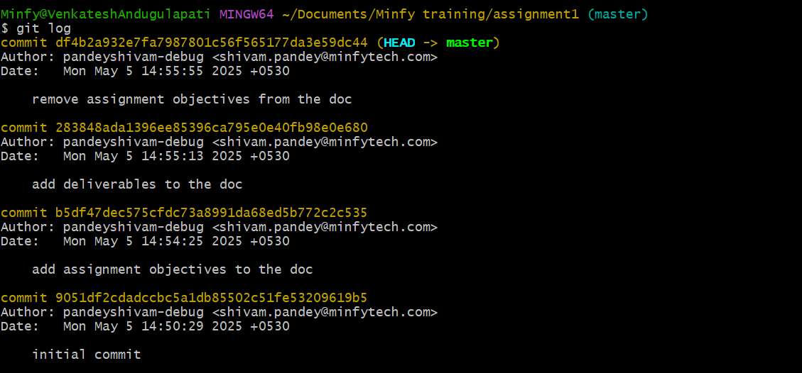

## GIT LOG:

## Changes made in each commit:

1. Created and added a file "textfile.txt" 
2. Added new text (assignment objectives to the file)
3. Added assignment deliverables to the file
4. Removed assignment objectives from the text file

## This change to README.md was made through--
### "feature/update-readme"